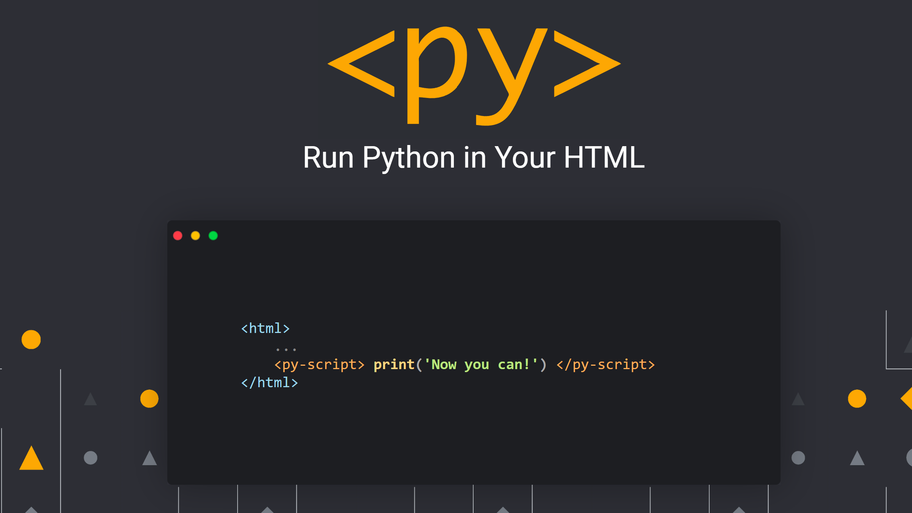

Folium Unemployment Demo:
https://bboczeng.github.io/PyLab/demo/folium.html

Factorial Demo:
https://bboczeng.github.io/PyLab/demo/factorial.html

Plotting Demo:
https://bboczeng.github.io/PyLab/demo/matplotlib.html

# PyLab
A **totally, totally, totally** no-install, no-download, no-config web-based scientific computing platform that actually supports Python. 

## Life is short. Use Python. 
PyLab natively supports Python, and all great science computing packages in it: Numpy, Scikit-learn, Matplotlib, Pytorch(\*), Tensorflow(\*), etc. 

## An online, browser based Python envrioment that is customized for Data Science 
PyLab is based on PyScript, a project powered by Scientific Computation leader Anaconda 

