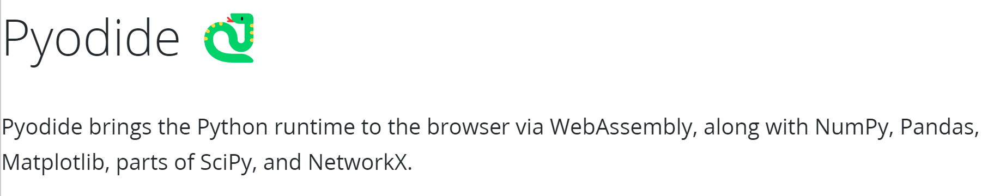

# PyLab: An in-browser Python environment for Data Science 
A **totally, totally, totally** no-install, no-download, no-config in-browser scientific computing platform based on Python. 

Please visit this website for demo:

[CCU, The Cat Computing Universe that actually supports Python and GPU!](https://cat-computing-universe.github.io/PyLab/)

## Life is short. Use Python. 
PyLab natively supports Python, and all great science computing packages in it: Numpy, Scipy, Scikit-learn, Matplotlib, Pytorch(\*), Tensorflow(\*), etc. 

\* depends on our research and funding in the future.

## Demos
* [GPU Acceleration](https://cat-computing-universe.github.io/PyLab/demo/matrix/gpu_accelerate.html) (*Notacibly another Web based computing platform get it wrong*)
* [REPL Playground](https://cat-computing-universe.github.io/PyLab/demo/repl.html)
* More, see the [Front Page](https://cat-computing-universe.github.io/PyLab/)

## Acknowledgments 
PyLab frontend is powered by PyScript, a project lead by Scientific Computation leader Anaconda

PyLab backend is powered by Pyodide (the same backend that supports PyScript), lead by Mozzila as a outcome of [Iodide](https://alpha.iodide.io/), the first Web based scientific computation platform online.

PyLab GPU is based on GPU.js, a project lead by [GPU Rocks](https://gpu.rocks/#/)

